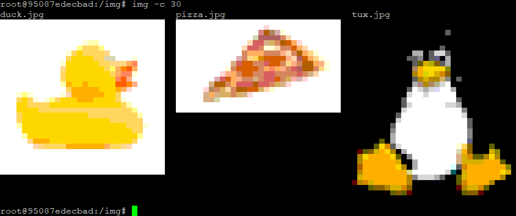

# img

Print images in the terminal using ANSI codes

 - Sets foreground and background color of half block unicode "▄" to represent two pixels for each character
 - Matches colors with closest ANSI extended color (16-231)
 - Color lookup table for quick rendering of large images
 - Depends on Pillow for image processing

## Features

 - List all images in current dir with thumbnails and filenames `img`
 - Print single image to fit terminal `img image.jpg`
 - Custom size options `--cols` and/or `--rows`
 - Accepts raw image data over stdin `cat image.jpg | img -`
 - `img.process_image(path)` returns the image rows as strings

## CLI Tool Installation

`pipx install "git+https://github.com/oysols/img"`
